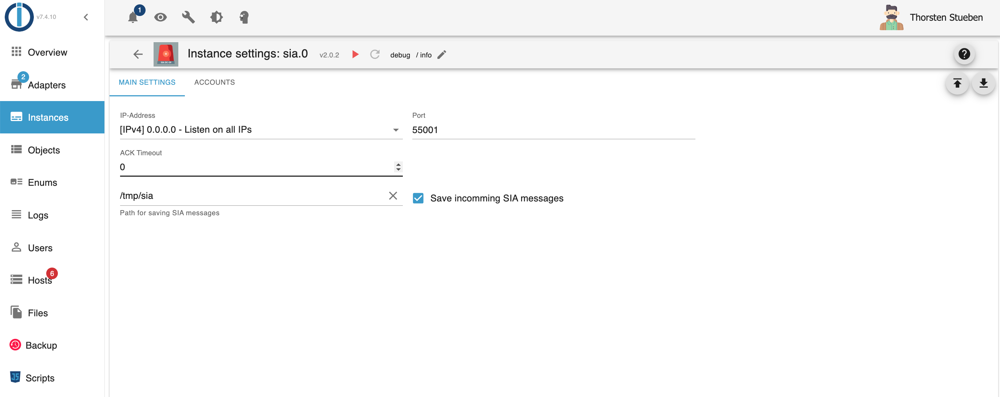
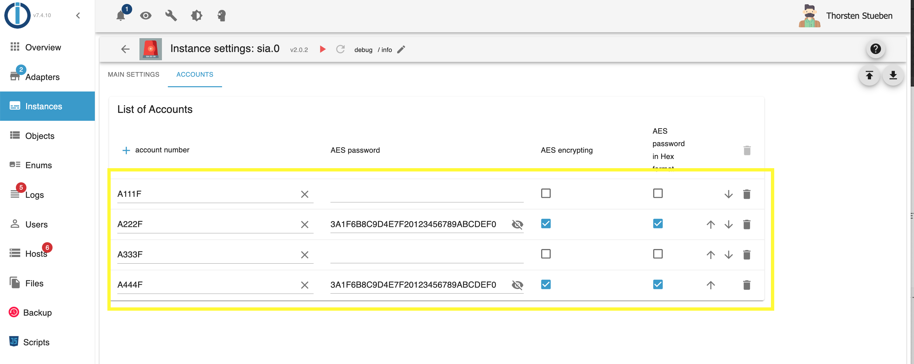
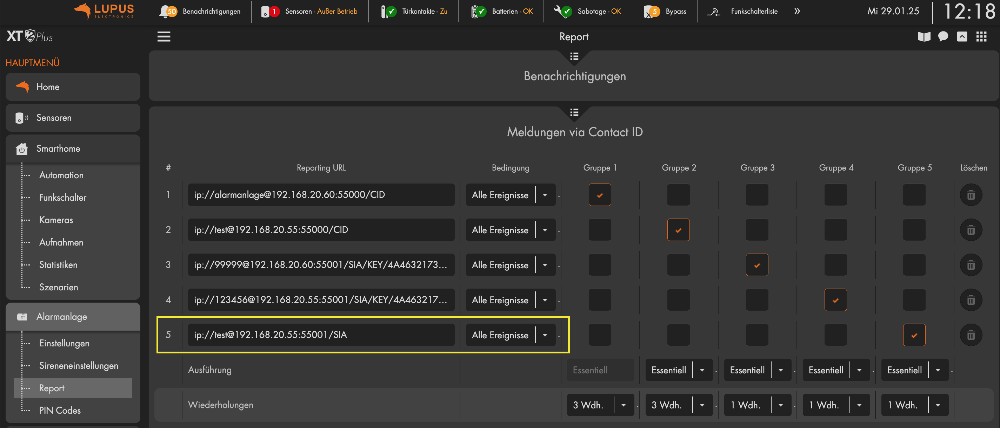
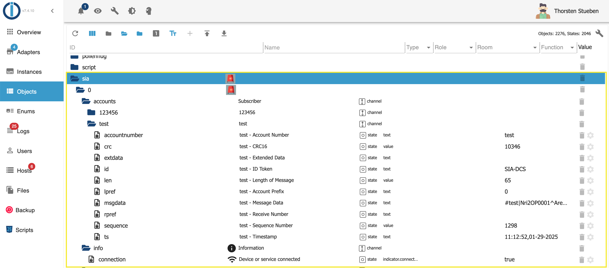

# ioBroker.sia

==================

  

Requires node.js 20.0 or higher and Admin v5!

The protocol SIA DC-09 is used by alarm systems to communicate with the central stations.

This adapter is a SIA Server. When an alarm event is triggered, the alarm system sends over IP the sia message to the central station.
You can use ioBroker with this adapter as central station. For example. you can send for a alarm by SIA a telegram message.

[SIA DC-09 protocol](https://www.yumpu.com/en/document/view/47594214/dc-09-preparing-for-ansi-public-review-security-industry-)

## Install & Configuration

1. Install the adapter
2. Configuration of the adapter:

Choose the IP-address and port for listening for SIA requests.

Register account number. If you are using AES you have to enter a password (key). The key should be 16, 24 or 32 characters (byte) long.
If the checkbox "AES password in Hex format" is active, the password length must be 32, 48 or 64 character (byte) long.
In the field ACK timeout, you define how old the message can be in sec. If you define 0 sec., no timeout validation will be done.

3. Configure your burglar system to send SIA messages

    - Lupusec XT1+/XT2/XT2+/XT3/XT4:

        Einstellungen -> Contact ID : ip://subcriber@ip-address-iobroker:port/SIA
        Example: ip://test@192.168.20.1:55001/SIA

        

    - Other alarm systems:

        the Adapter will work with all alarm systems, which supports
        the SIA DC-09 protocol

4. SIA Objects / States

If you receive SIA messages, you see them in the states tree under the chanel accounts

5. Problems / Issues

If you have problems processing SIA messages, please create an issue.
In the issue I need the following information:

1. Manufacturer and type of alarm system
2. The SIA message as a file. You can create a file if you activate it in the instance configuration.
3. If you use encryption (AES), then I need the key to decrypt the message again.
4. The debug output from ioBroker when processing the message
5. Detailed description of the error

After you have completed points 2 and 3, please change the key.

## Changelog

### **WORK IN PROGRESS**

- (Stübi) Redesign of Contact ID Adapter.
- (Stübi) Wokring now with nodejs 20 and 22
- (Stübi) js-controller in version 6 and 7 will be supported
- (Stübi) Ability to save SIA messages.

### 1.0.4 (17.11.2019)

- (Stübi) Bugfixing, changing the time calculation for ACK and NACK messages
- (Stübi) Small improvements to the SIA protocol
- (Stübi) Changed bug in encrypting. Delete appending 8 \* 0x10
- (Stübi) Support of UDP. Same port listening as TCP
- (Stübi) Saving password encrypted.
- (Stübi) ACK and NAC calculation extended.
- (Stübi) CRC can be send in 0xABCD (2 Byte) or ABCD (4 Byte, ASCII) format. Automatic recognizing
- (Stübi) AES Password can be in AES-128-CBC, AES-192-CBC or AES-256-CBC
- (Stübi) AES Password can be saved in byte or hex (length 16, 24 or 32 byte) format or hex (length 32, 48 or 64 hex) format
- (Stübi) Timeout for ACK (0 = disable, 1 - n sec)
- (Stübi) Set ioBroker States of message on ACK not on NACK
- (Stübi) Support js-controller compact mode
- (Stübi) Update Adapter Core File
- (Stübi) Bugfxing (NAK) and AES support
- (Stübi) Translations
- (Stübi) Requires nodejs 6.0 or higher
- (Stübi) Cleanup
- (Stübi) SIA regex optimized
- (Stübi) bug fixing
- (Stübi) first implementation

## License

The MIT License (MIT)

Copyright (c) 2025 Thorsten <thorsten@stueben.de>

Permission is hereby granted, free of charge, to any person obtaining a copy
of this software and associated documentation files (the "Software"), to deal
in the Software without restriction, including without limitation the rights
to use, copy, modify, merge, publish, distribute, sublicense, and/or sell
copies of the Software, and to permit persons to whom the Software is
furnished to do so, subject to the following conditions:

The above copyright notice and this permission notice shall be included in
all copies or substantial portions of the Software.

THE SOFTWARE IS PROVIDED "AS IS", WITHOUT WARRANTY OF ANY KIND, EXPRESS OR
IMPLIED, INCLUDING BUT NOT LIMITED TO THE WARRANTIES OF MERCHANTABILITY,
FITNESS FOR A PARTICULAR PURPOSE AND NONINFRINGEMENT. IN NO EVENT SHALL THE
AUTHORS OR COPYRIGHT HOLDERS BE LIABLE FOR ANY CLAIM, DAMAGES OR OTHER
LIABILITY, WHETHER IN AN ACTION OF CONTRACT, TORT OR OTHERWISE, ARISING FROM,
OUT OF OR IN CONNECTION WITH THE SOFTWARE OR THE USE OR OTHER DEALINGS IN
THE SOFTWARE.
